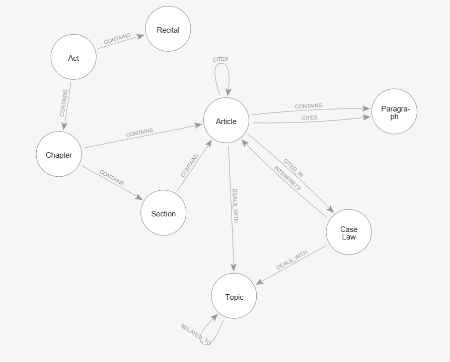

# Legal KG V1
## Document assumption
The following knowledge graph is evaluated based on the Eurolex document structure. In particular, the following assumptions were considered:
* Each **act** is composed of one or more **chapters**
* Each **chapter** is composed of one or more **articles**
    * In some cases, **articles** will be divided into **sections** rather than directly into **chapters** (Chapter -> Section -> Article)
* **Articles** may cite other **articles** or **paragraphs**
* An **article** is typically composed of a series of **paragraphs**
* **Case law** interprets **articles**; one or more **case law** may refer to a specific **article** or **act**

## Knowledge Graph


## Nodes
In order to maintain the uniqueness of nodes such as articles or chapters (which remain constant across different documents), it was decided to utilise a string that combines the unique identifier of the act (CELEX) provided by Eurolex and the identifier of the chapter/article, etc.

### Act
```
celex: String 
act_title: String
author: String
publication_date: Datetime
date_of_application: Datetime
eurlex_url: String
```

### Recitals
```
recital_id: String         #CELEX+num_recital
text
```

### Chapter
```
chapter_id: String         #CELEX+num_chapter
chapter_number: String     #Roman numerals -> I, II, III
chapter_title: String
```

### Section
```
section_id: String         #CELEX+num_section
section_title: String
```


### Article
```
article_id: String        #CELEX+num_article
article_title: String
full_text: String
```

### Paragraph
```
paragraph_id: String         #CELEX+num_paragraph
text: String
```

### Case Law
```
case_id: String           #C-594/25
case_title: String
referring_court: String
curia_url: String
lodged_date: Datetime
appellant: String
respondent: String
```

### Topic
```
id: Integer
topic_name: String
```

## Document Parsing and Data Retrieval
Eurolex continues to be the primary source for data retrieval; information must be extracted from documents that can be retrieved in HTML format (and parsed in the preferred format).


## Extractions

```sql
MATCH p1 = (act:Act)-[:CONTAINS]->(chapter1:Chapter),
      p2 = (act)-[:CONTAINS]->(chapter2:Chapter),
      p3 = (act)-[:CONTAINS*1..2]->(section:Section),
      p4 = (section)-[:CONTAINS]->(article:Article),
      p5 = (article)-[:CONTAINS]->(paragraph:Paragraph)
WHERE chapter1 <> chapter2

WITH p1, p2, p3, p4, p5, article
MATCH p6 = (article)-[:CITES]->(cited_article:Article)
WHERE cited_article.article_id IN ['32016R0679art_6', '32016R0679art_9', '32016R0679art_22', '32016R0679art_46']

RETURN p1, p2, p3, p4, p5, p6
LIMIT 20
```
This extract illustrates the entire Eurolex document tree, beginning with the **act**, which is then divided into **chapters** (identified with *Roman numerals*).
The **sections** are "optional"; in this example, they are present and contain the **article** and its **paragraphs**. Finally, we also note the presence of a *CITES* relationship to Article 22 cited in Article 12.

---


```sql
MATCH (act:Act {celex: '32016R0679'})
MATCH (act)-[:CONTAINS]->(chapter:Chapter)
WITH act, chapter
ORDER BY chapter.chapter_number
LIMIT 1
MATCH path = (act)-[:CONTAINS]->(chapter)-[:CONTAINS*1..3]->(node)
RETURN path
```